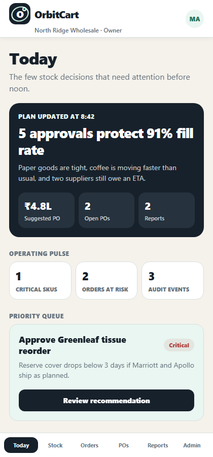
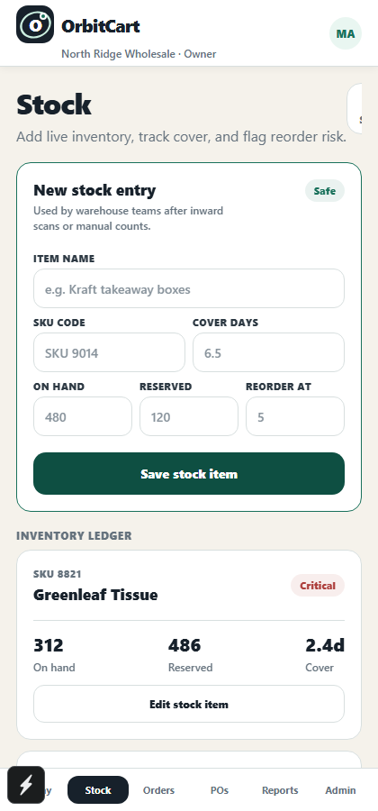
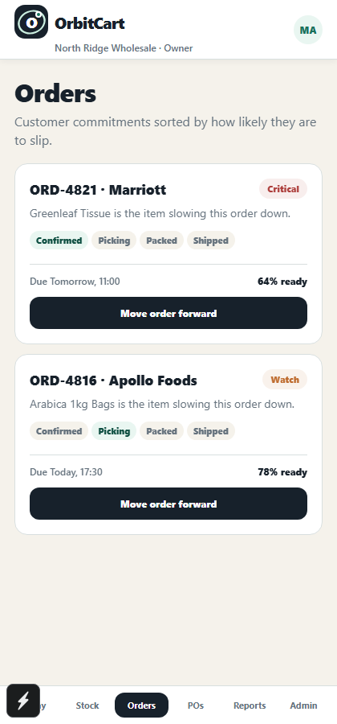
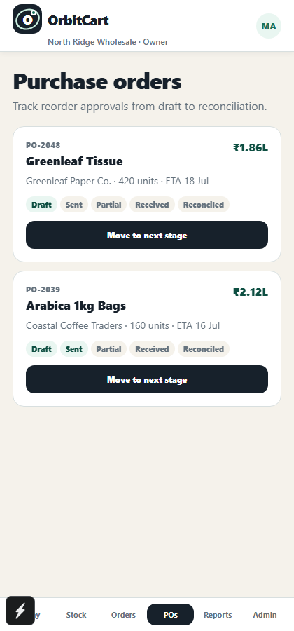
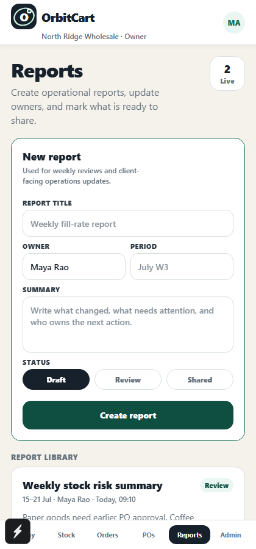
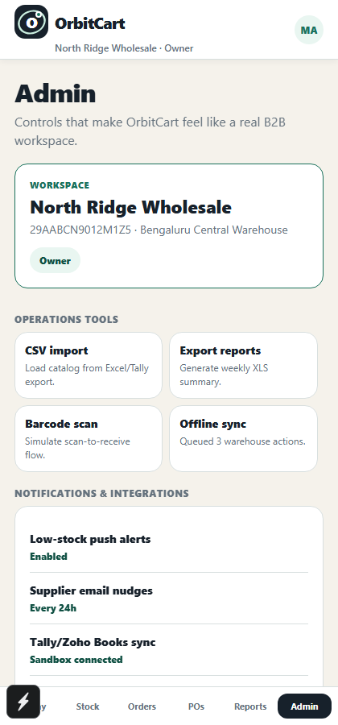

# OrbitCart

OrbitCart is a B2B SaaS mobile app for wholesale distributors. It gives operations teams a single workflow for reorder priorities, order-risk visibility, supplier follow-up, and purchase-order approval — this is CyphronTech's OrbitCart case study build, running entirely on mocked data with no backend required.

| Today | Stock | Orders |
| --- | --- | --- |
|  |  |  |

| Purchase Orders | Reports | Admin |
| --- | --- | --- |
|  |  |  |

## Stack

- React Native with Expo (SDK 57)
- TypeScript
- AsyncStorage for local persistence — every screen reads and writes through it, so state survives reloads
- Mocked demo data (`src/data/demoData.ts`) — no backend, no API keys, no setup required

## Start

```bash
npm install
npm run start
```

Then press `a` for Android, `i` for iOS, or `w` for web. Sign in with the prefilled demo account (`maya@nrwholesale.co` / `orbit-demo`), or register a new one — both run entirely offline against local storage.

## App flow

Login -> workspace onboarding -> Today dashboard -> drill into a screen (Stock, Orders, POs, Reports) -> take an action (approve, advance, save) -> change persists and shows up in Admin's audit trail.

## Screens

| Screen | Purpose |
| --- | --- |
| Login | Email/password sign-in or registration, both mocked locally |
| Onboarding | Capture business name, GSTIN, warehouse, and operating role |
| Today | Daily priorities: suggested PO value, fill-rate protection, critical SKUs, orders at risk |
| Stock (Inventory) | Add/edit SKUs, track cover days and reorder risk (Safe/Watch/Critical) |
| Orders | Customer orders ranked by risk, with a fulfilment lifecycle (Confirmed → Picking → Packed → Shipped) |
| Purchase Orders | PO lifecycle from Draft through Sent, Partial, Received, to Reconciled |
| Reports | Draft, review, and share operational reports |
| Admin | Workspace identity, operations tools (CSV import, export, barcode scan, offline sync), notification/integration settings, team roles, and audit trail |

## Project structure

```
App.tsx                  App shell: auth gate, tab navigation, local-storage wiring
src/screens/              One file per screen listed above
src/components/           Card, RiskBadge, OrbitLogo
src/services/authService.ts   Mocked email auth (AsyncStorage-backed, no network)
src/data/demoData.ts      Seed data: products, orders, suppliers, recommendations
src/theme/theme.ts         Colors, spacing, type scale
src/types/domain.ts        Shared TypeScript types
```

## Notes

- No backend, Firebase, or network calls — everything runs against `AsyncStorage`. This keeps the app runnable anywhere with zero setup, at the cost of no real multi-device sync.
- `npm run typecheck` runs a clean `tsc --noEmit` pass.
